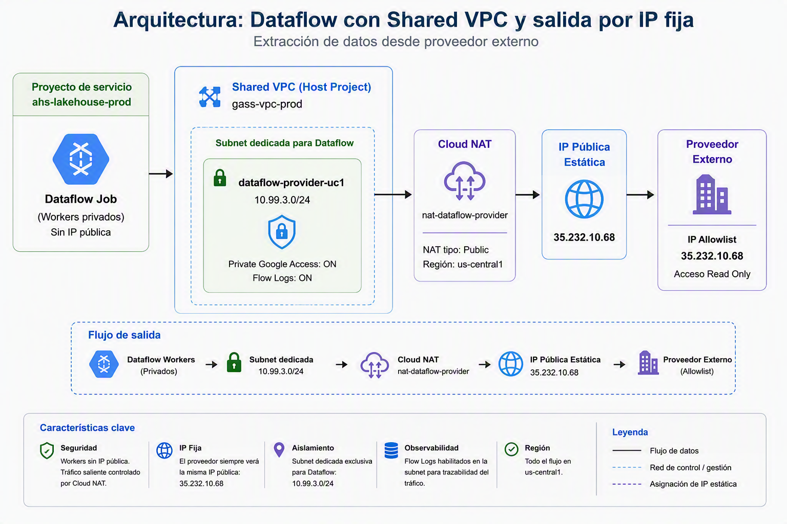

# Dataflow con Shared VPC y salida mediante IP Pública Fija GCP

## Descripción

Implementación de una arquitectura en Google Cloud Platform (GCP) para extracción de datos desde un proveedor externo utilizando Dataflow y una Shared VPC.

La solución permite que todo el tráfico saliente de Dataflow utilice una dirección IP pública fija para su registro en listas de acceso (Allowlist) del proveedor.

---

# Arquitectura

<p align="center">
  
</p>

## Descripción

La solución utiliza **Google Cloud Dataflow** para realizar la extracción de información desde el proveedor hacia el entorno de Google Cloud.

La comunicación se realiza mediante:

- **Shared VPC** en el proyecto `productivo`.
- **Service Project** `lakedata-prod`.
- Subnet dedicada para los procesos de **Dataflow**.
- **Cloud NAT** para proporcionar una IP pública de salida controlada.
- Comunicación con el proveedor mediante **TLS**.
- Lista de IPs autorizadas (**Allowlist**) en el proveedor.
- Acceso de solo lectura a la información del proveedor.
- Sin exposición directa de las instancias de Dataflow a Internet.

### Flujo de comunicación

```text
Proveedor
    │
    │ TLS
    ▼
Cloud NAT
    │
    │ IP pública autorizada
    ▼
Dataflow
    │
    ▼
Shared VPC
    │
    ├── prod
    │
    └── lakedata-productivo

---

# Objetivo

Permitir que los pipelines de Dataflow accedan a un proveedor externo utilizando una IP pública fija y controlada, manteniendo los workers sin direcciones IP públicas.

---

# Proyectos involucrados

| Tipo | Proyecto |
|--------|------------|
| Host Project | productivo |
| Service Project | lakedata-productivo |

---

# Componentes implementados

## Shared VPC

```text
vpc-prod
```

Ubicada en:

```text
prod
```

---

## Subnet dedicada para Dataflow

Nombre:

```text
dataflow-provider-uc1
```

Región:

```text
us-central1
```

CIDR:

```text
10.99.3.0/24
```

Configuración:

- Private Google Access = ON
- VPC Flow Logs = ON

---

## Cloud Router

Nombre:

```text
router-dataflow-uc1
```

Región:

```text
us-central1
```

Red:

```text
vpc-prod
```

---

## Cloud NAT

Nombre:

```text
nat-dataflow-provider
```

Tipo:

```text
Public NAT
```

Subnet asociada:

```text
dataflow-provider-uc1
```

---

## Dirección IP pública fija

Nombre:

```text
nat-dataflow-provider-ip
```

IP:

```text
35.232.10.68
```

Tipo:

```text
Regional
```

Región:

```text
us-central1
```

---

# Cuenta de servicio observada

```text
0000000000compute@developer.gserviceaccount.com
```

Roles identificados:

- Compute Network User
- Compute Network Admin
- BigQuery Admin
- BigQuery Data Viewer
- BigQuery Job User
- Dataform Admin
- Dataform Editor
- Service Account User
- Storage Object Admin

---

# Configuración recomendada para Dataflow

Región:

```text
us-central1
```

Subred:

```text
projects/host-prod/regions/us-central1/subnetworks/dataflow-provider-uc1
```

Workers:

```text
Sin IP pública
```

---

# Flujo de conectividad

```text
Dataflow Workers
        │
        ▼
dataflow-provider-uc1
(10.99.3.0/24)
        │
        ▼
Cloud NAT
        │
        ▼
35.232.10.68
(IP de salida)
        │
        ▼
Proveedor Externo
```

---

# Dirección para Allowlist

La dirección que deberá registrar el proveedor es:

```text
35.232.10.68
```

---

# Validación pendiente

Antes de pasar a producción se debe ejecutar un Dataflow de prueba para validar:

- Creación correcta de workers.
- Uso de la subnet `dataflow-provider-uc1`.
- Conectividad hacia el proveedor.
- Confirmación de la IP observada por el proveedor.
- Generación de tráfico en Cloud NAT.

---

# Monitoreo

## Cloud NAT

Ruta:

```text
Network Services
→ Cloud NAT
→ nat-dataflow-provider
→ Monitoring
```

Métricas recomendadas:

- Connections
- Used Ports
- Sent Bytes
- Received Bytes

---

## Logs

Ruta:

```text
Logging
→ Logs Explorer
```

Filtro:

```text
resource.type="nat_gateway"
```

o

```text
resource.labels.gateway_name="nat-dataflow-provider"
```

---

# Estado del proyecto

✅ Shared VPC configurada

✅ Service Project asociado

✅ Subnet dedicada creada

✅ Cloud Router creado

✅ Cloud NAT creado

✅ IP pública fija reservada

✅ IAM validado


